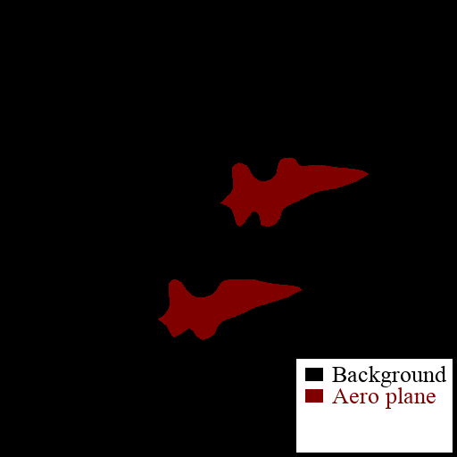

# Exposing Semantic Segmentation Failures via Maximum Discrepancy Competition

This repository is for the paper "Exposing Semantic Segmentation Failures via Maximum Discrepancy Competition",
[Jiebin Yan](https://github.com/QTJiebin), [Yu Zhong](https://github.com/zhy1887996acm), [Yuming Fang](http://sim.jxufe.cn/JDMKL/ymfang.html), [Zhangyang Wang](https://vita-group.github.io/group.html), [Kede Ma](https://kedema.org/), *International Journal of Computer Vision*, 2021. (Paper link: [**Arxiv**](https://arxiv.org/abs/2103.00259))

## Database
The Semantic Segmentation Challenge (SS-C) database and the annotations (".npy") can be downloaded at the [**Baidu Yun**](https://pan.baidu.com/s/1adhYML0695eUSwdX5vSCDQ) (Code: d7gs) or [**MEGA**](https://mega.nz/folder/a9QjHawJ) (Code: lbf8f-ano8EcZZ4EDGfsfQ).

## Usage

```shell script
# To create urls database, then:
# Fill your api.unsplash ACCESS_KEY in `./downloader/FullSite.py` first。
python downloader/manage.py

# To download images from crawled urls:
# For convenience, we provide the urls obtained in our work, 
# see `./downloader/database/link.db`.
python downloader/PengDownloader.py

# To rename and resize the images:
python downloader/rename_each_class.py

# To compare the results of each model and select MAD samples:
python select_MAD_samples.py

# To convert a "***.npy" label to a visualization image:
python cvat2voc.py ***.npy
```
The data downloader reference: [UnsplashDownloader](https://github.com/hating/UnsplashDownloader) by [hating](https://github.com/hating).

&emsp;　 &emsp;　&emsp;　&emsp;　 &emsp;　&emsp;　&emsp;　　&emsp;　&emsp <br>

## Test Semantic Segmentation Models

- L. Chen, Y. Zhu, G. Papandreou, F. Schroff, and H. Adam. Encoder-Decoder with Atrous Separable Convolution for Semantic Image Segmentation. In *European Conference
on Computer Vision*, 801-818, 2018.
- X. Li, Z. Zhong, J. Wu, Y. Yong, Z. Lin, and H. Liu. Expectation-maximization attention networks for semantic segmentation. In *IEEE International Conference on Computer Vision*, 9167-9176, 2019.
- H. Zhao, Y. Zhang, S. Liu, J. Shi, C. C. Loy, D. Lin, and J. Jia. PSANet: Point-wise spatial attention network for scene parsing. In *European Conference
on Computer Vision*, 267-283, 2018.
- H. Zhao, J. Shi, X. Qi, X. Wang, and J. Jia. Pyramid scene parsing network. In *IEEE International Conference on Computer Vision and Pattern Recognition*, 2881-2890, 2017.
- V. Nekrasov, C. Shen, and I. Reid. Light-weight RefineNet for real-time semantic segmentation. In *British Machine Vision Conference*, 2018.
- G. Lin, A. Milan, C. Shen, and I. Reid. RefineNet: Multi-path refinement networks for high-resolution semantic segmentation. In *IEEE International Conference on Computer Vision and Pattern Recognition*, 1925-1934, 2017.
- N. Dvornik, K. Shmelkov, J. Mairal, and C. Schmid. BlitzNet: A real-time deep network for scene understanding. In *IEEE International Conference on Computer Vision and Pattern Recognition*, 4154-4162, 2017.
- S. Mehta, M. Rastegari, L. Shapiro, and H. Hajishirzi. ESPNetv2: A ligh-weight, power efficient, and general purpose convolutional neural network. In *IEEE International Conference on Computer Vision and Pattern Recognition*, 9190-9200, 2019.
- S. Mehta, H. Hajishirzi, and M. Rastegari. DiCENet: Dimension-wise convolutions for efficient networks. In *IEEE International Conference on Computer Vision and Pattern Recognition*, 2019.
- J. Long, E. Shelhamer, and T. Darrell. Fully convolutional networks for semantic segmentation. In *IEEE International Conference on Computer Vision and Pattern Recognition*, 2015.

## Reference

- Z. Wang and E. P. Simoncelli. Maximum differentiation (MAD) competition: A methodology for comparing computational models for perceptual quantities. *Journal of Vision*, 8(12): 8–8, 2008.
- K. Ma, Z. Duanmu, Z. Wang, Q. Wu, W. Liu, H. Yong, H. Li, and L. Zhang. Group maximum differentiation competition: Model comparison with few samples. *IEEE Transactions on Pattern Analysis and Machine Intelligence*, 42(4): 851-864, 2020.
- H. Wang, T. Chen, Z. Wang, and K. Ma. I am going MAD: Maximum discrepancy competition for comparing classifiers adaptively. In *International Conference on Learning Representations*, 2020.

## Thanks
[Chenyang Le](https://leshier.github.io), [Yu Zhong](https://github.com/zhy1887996acm), and all participants in the subjective experiment.

## Citation
```bibtex
@article{yan2021exposing,
title={Exposing semantic segmentation failures via maximum discrepancy competition},
author={Yan, Jiebin and Zhong, Yu and Fang, Yuming and Wang, Zhangyang and Ma, Kede},
journal={International Journal of Computer Vision},
volume={129},
pages={1768–1786},
year={2021}
}


